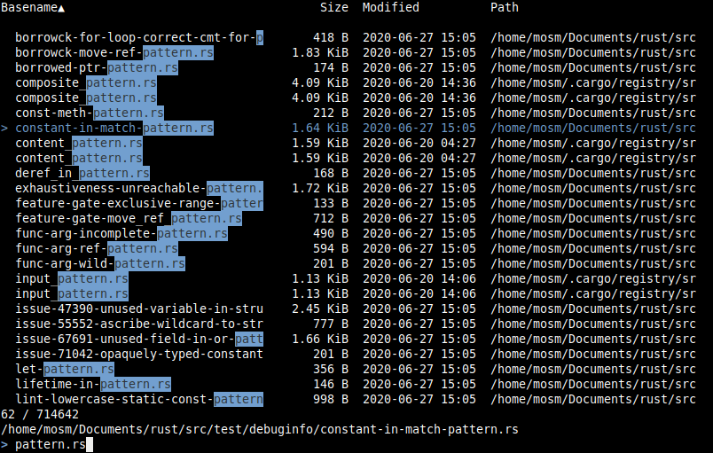

# indexa

[](https://github.com/mosmeh/indexa/actions)

A locate alternative with incremental search



## Installation

Clone this repository and run:

```sh
cargo install --path .
```

## Usage

Try the following:

```sh
# view and search files & directories
ix

# choose which file to open in vi
vi $(ix)
```

On the first launch, indexa will ask you if you want to create a database with a default configuration.

To update the database:

```sh
ix -u
```

## Configuration

indexa's configuration file is located at `~/.config/indexa/config.toml` on Unix and `C:\Users\<USER>\AppData\Roaming\indexa\config.toml` on Windows.

## Key bindings

- <kbd>Enter</kbd> to select current line and quit
- <kbd>Esc</kbd> / <kbd>C-C</kbd> / <kbd>C-G</kbd> to abort
- <kbd>Up</kbd> / <kbd>C-p</kbd> / <kbd>C-k</kbd>, <kbd>Down</kbd> / <kbd>C-n</kbd> / <kbd>C-j</kbd>, <kbd>Page Up</kbd>, and <kbd>Page Down</kbd> to move cursor up/down
- <kbd>C-Home</kbd> / <kbd>Shift-Home</kbd> and <kbd>C-End</kbd> / <kbd>Shift-End</kbd> to scroll to top/bottom of the list
- <kbd>C-a</kbd> / <kbd>Home</kbd> and <kbd>C-e</kbd> / <kbd>End</kbd> to move cursor to beginning/end of query
- <kbd>C-u</kbd> to clear the query
